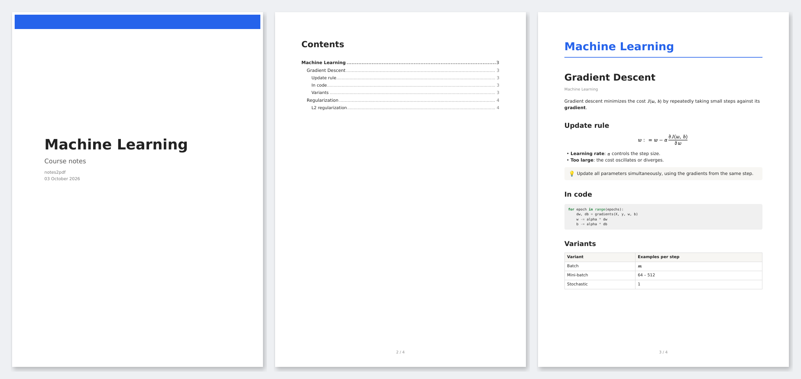

# notes2pdf

Turns your Notion notes into PDFs. You choose which pages go into each PDF; equations,
code, tables, images and databases are kept, with an optional cover and linked table
of contents.



## Requirements

- Python 3.11+ and [uv](https://docs.astral.sh/uv/)
- Pango (`sudo apt install libpango-1.0-0 libpangoft2-1.0-0` on Ubuntu)
- A Notion [internal integration](https://www.notion.so/my-integrations) with access to your pages
  (`···` → **Connections** on the root page)

## Usage

```bash
uv sync
uv run playwright install chromium   # optional: snapshots of interactive HTML embeds
cp .env.example .env                 # add your NOTION_TOKEN
cp bundles.example.yml bundles.yml   # list the pages for each PDF
uv run build.py
```

Each entry in `bundles.yml` is one PDF:

```yaml
bundles:
  - title: Exam review
    output: out/review.pdf
    include:
      - page: https://www.notion.so/Topic-1-<id>
      - page: https://www.notion.so/Topic-3-<id>
```

All options are described in [bundles.example.yml](bundles.example.yml).
